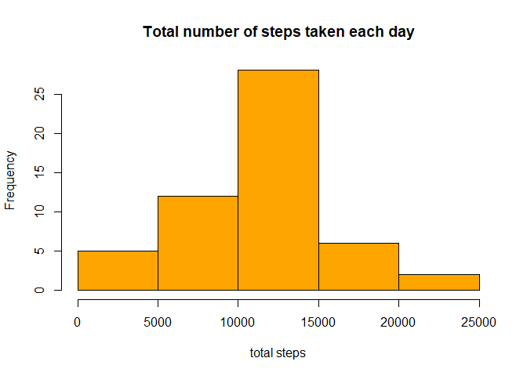
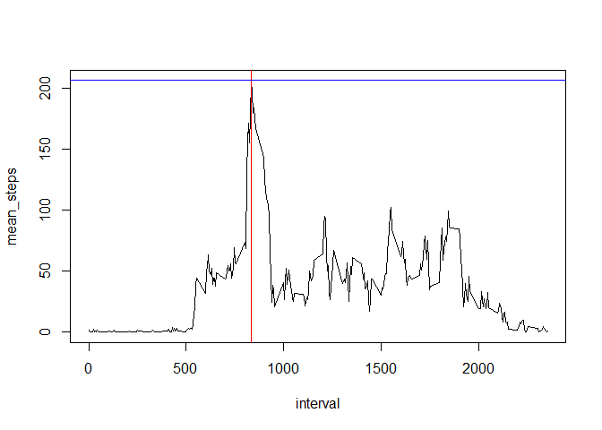
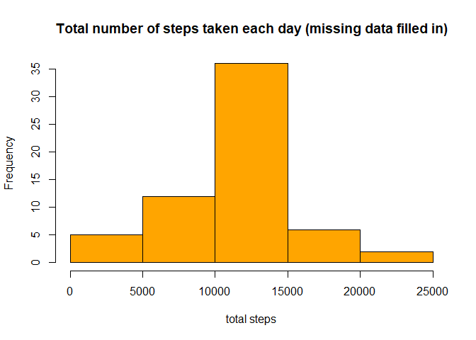
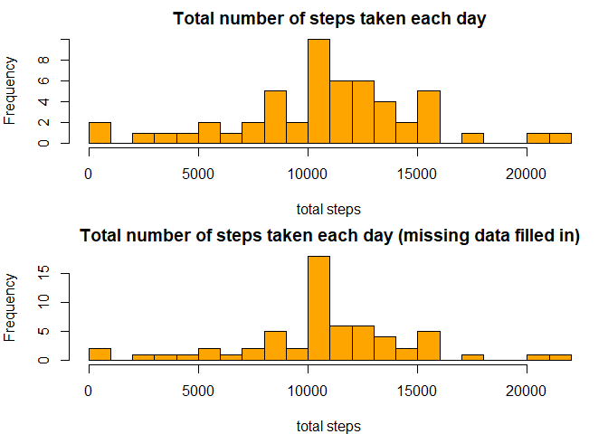
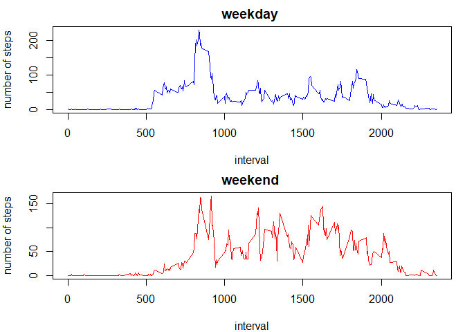

# Introduction

It is now possible to collect a large amount of data about personal movement using activity monitoring devices such as a Fitbit, Nike Fuelband, or Jawbone Up. These type of devices are part of the "quantified self" movement -- a group of enthusiasts who take measurements about themselves regularly to improve their health, to find patterns in their behavior, or because they are tech geeks. But these data remain under-utilized both because the raw data are hard to obtain and there is a lack of statistical methods and software for processing and interpreting the data.

This report makes use of data from a personal activity monitoring device. This device collects data at 5 minute intervals through out the day. The data consists of two months of data from an anonymous individual collected during the months of October and November, 2012 and include the number of steps taken in 5 minute intervals each day.

The data for this report has been downloaded from the GitHub repository.

The purpose of this report is to answer some questions detailed below.

Firstly, I set global option **echo = TRUE**, in order the code is include in the body of the report.


## Loading and preprocessing the data

The variables included in this dataset are:

- steps: number of steps taking in a 5-minute interval (missing values are coded as NA).

- date: the date on which the measurement was taken in YYYY-MM-DD format.

- interval: identifier for the 5-minute interval in which measurement was taken.

Some lines of this data are shown in **Table T1**:


```r
# Read the dataset
activity <- read.csv("activity.csv", header = TRUE, sep = ",", na.strings = "NA")
# Transform the 'date' class from "Factor" to "Date"
activity$date <- as.Date(activity$date, format = "%Y-%m-%d")
```

Table: T1 - Head of original 'activity' dataset

 Steps       Date       Interval 
-------  ------------  ----------
  NA      2012-10-01       0     
  NA      2012-10-01       5     
  NA      2012-10-01       10    
  NA      2012-10-01       15    
  NA      2012-10-01       20    
  NA      2012-10-01       25    

## What is mean total number of steps taken per day?

A histogram is a visual representation of the distribution of a dataset. As such, the shape of a histogram is its most evident and informative characteristic: it allows you to easily see where a relatively large amount of the data is situated and where there is very little data to be found. In other words, you can see where the middle is in your data distribution, how close the data lie around this middle and where possible outliers are to be found.

For this case, the histogram of the total number of steps taken each day is shown in **Plot H1**.


```r
# Clean missing values in the dataset
activity_clean <- filter(activity, activity$steps!="NA")
# Calculate total of steps for each day and create a new dataset 
activity_sum <- data.frame(date = unique(activity_clean$date), sum_steps = tapply(activity_clean$steps, activity_clean$date, sum))
# Plot the histogram
hist(activity_sum$sum_steps, col = "orange", xlab = "total steps", main = "Total number of steps taken each day")
```

<!-- -->

Data of total steps for each date are shown in the **Table T2**.

Table: T2 - Total number of steps taken each day

    date       sum_steps 
------------  -----------
 2012-10-02       126    
 2012-10-03      11352   
 2012-10-04      12116   
 2012-10-05      13294   
 2012-10-06      15420   
 2012-10-07      11015   
 2012-10-09      12811   
 2012-10-10      9900    
 2012-10-11      10304   
 2012-10-12      17382   
 2012-10-13      12426   
 2012-10-14      15098   
 2012-10-15      10139   
 2012-10-16      15084   
 2012-10-17      13452   
 2012-10-18      10056   
 2012-10-19      11829   
 2012-10-20      10395   
 2012-10-21      8821    
 2012-10-22      13460   
 2012-10-23      8918    
 2012-10-24      8355    
 2012-10-25      2492    
 2012-10-26      6778    
 2012-10-27      10119   
 2012-10-28      11458   
 2012-10-29      5018    
 2012-10-30      9819    
 2012-10-31      15414   
 2012-11-02      10600   
 2012-11-03      10571   
 2012-11-05      10439   
 2012-11-06      8334    
 2012-11-07      12883   
 2012-11-08      3219    
 2012-11-11      12608   
 2012-11-12      10765   
 2012-11-13      7336    
 2012-11-15       41     
 2012-11-16      5441    
 2012-11-17      14339   
 2012-11-18      15110   
 2012-11-19      8841    
 2012-11-20      4472    
 2012-11-21      12787   
 2012-11-22      20427   
 2012-11-23      21194   
 2012-11-24      14478   
 2012-11-25      11834   
 2012-11-26      11162   
 2012-11-27      13646   
 2012-11-28      10183   
 2012-11-29      7047    

Also, the mean and median total number of steps taken per day are shown in **Table T3**.


```r
# Calculate mean and median of steps for each day and create a new dataset 
activity_mm <- data.frame(date = unique(activity_clean$date), mean_steps = tapply(activity_clean$steps, activity_clean$date, mean), median_steps = tapply(activity_clean$steps, activity_clean$date, median))
```

Table: T3 - Mean and median total number of steps taken per day

    Date       Mean Steps    Median Steps 
------------  ------------  --------------
 2012-10-02    0.4375000          0       
 2012-10-03    39.4166667         0       
 2012-10-04    42.0694444         0       
 2012-10-05    46.1597222         0       
 2012-10-06    53.5416667         0       
 2012-10-07    38.2465278         0       
 2012-10-09    44.4826389         0       
 2012-10-10    34.3750000         0       
 2012-10-11    35.7777778         0       
 2012-10-12    60.3541667         0       
 2012-10-13    43.1458333         0       
 2012-10-14    52.4236111         0       
 2012-10-15    35.2048611         0       
 2012-10-16    52.3750000         0       
 2012-10-17    46.7083333         0       
 2012-10-18    34.9166667         0       
 2012-10-19    41.0729167         0       
 2012-10-20    36.0937500         0       
 2012-10-21    30.6284722         0       
 2012-10-22    46.7361111         0       
 2012-10-23    30.9652778         0       
 2012-10-24    29.0104167         0       
 2012-10-25    8.6527778          0       
 2012-10-26    23.5347222         0       
 2012-10-27    35.1354167         0       
 2012-10-28    39.7847222         0       
 2012-10-29    17.4236111         0       
 2012-10-30    34.0937500         0       
 2012-10-31    53.5208333         0       
 2012-11-02    36.8055556         0       
 2012-11-03    36.7048611         0       
 2012-11-05    36.2465278         0       
 2012-11-06    28.9375000         0       
 2012-11-07    44.7326389         0       
 2012-11-08    11.1770833         0       
 2012-11-11    43.7777778         0       
 2012-11-12    37.3784722         0       
 2012-11-13    25.4722222         0       
 2012-11-15    0.1423611          0       
 2012-11-16    18.8923611         0       
 2012-11-17    49.7881944         0       
 2012-11-18    52.4652778         0       
 2012-11-19    30.6979167         0       
 2012-11-20    15.5277778         0       
 2012-11-21    44.3993056         0       
 2012-11-22    70.9270833         0       
 2012-11-23    73.5902778         0       
 2012-11-24    50.2708333         0       
 2012-11-25    41.0902778         0       
 2012-11-26    38.7569444         0       
 2012-11-27    47.3819444         0       
 2012-11-28    35.3576389         0       
 2012-11-29    24.4687500         0       

## What is the average daily activity pattern?

Every day has 24 hours, that is equal to 288 intervals of 5 minutes. For the 53 differentes dates that are included in our dataset, it is required to know the average number of steps for each one of the 288 intervals. The plot that is obtained from that analysis is shown in **Plot P1**.


```r
# New dataset with mean of steps for each 5 minutes interval
activity_interval <- data.frame(interval = unique(activity_clean$interval), mean_steps = tapply(activity_clean$steps, activity_clean$interval, mean))
# Plot of the 5-minute interval (x-axis) and the average number of steps taken, averaged across all days (y-axis)
with(activity_interval, plot(interval, mean_steps, type = "l"), title = "Average steps taken by interval")
```

<!-- -->


It can be observed in the plot that the interval with the maximum number of steps (206.1698113) is 835. See **Plot P2**.


```r
# Add horizontal and vertical lines in the plot for the maximum value of steps
with(activity_interval, plot(interval, mean_steps, type = "l"), title = "Average steps taken by interval")
abline(v=subset(activity_interval, activity_interval$mean_steps == max(activity_interval$mean_steps))[1,1], col = "red")
abline(h=subset(activity_interval, activity_interval$mean_steps == max(activity_interval$mean_steps))[1,2], col = "blue")
```

<!-- -->

## Imputing missing values


The total number of missing values in the original dataset is 2304.

If we fill every NA value with the mean of steps for that same interval, we get the following histogram of the total number of steps taken each day. See **Plot H2**.


```r
# New dataset to fill 'NA' values
activity_nonas <- activity
# Loop along the original dataset searching 'NA' values and replace them with the average number of steps for the same interval
for (i in (1:nrow(activity_nonas))){
        # locate 'NA' value
        if (is.na(activity_nonas$steps[i]) == TRUE ){
                for (j in (1:nrow(activity_interval))){
                        # locate same interval
                        if (activity_interval[j,1] == activity$interval[i]){
                                # fill the 'NA' value with the mean of steps for that interval
                                activity_nonas$steps[i]<-activity_interval[j,2]
                        }
                }
                
        }
}

# As it was done for the original dataset, calculate total of steps for each day and create a new dataset 
activity_nonas_sum <- data.frame(day = unique(activity_nonas$date), sum_steps = tapply(activity_nonas$steps, activity_nonas$date, sum))
# Plot the histogram
hist(activity_nonas_sum$sum_steps, col = "orange", xlab = "total steps", main = "Total number of steps taken each day (missing data filled in)")
```

<!-- -->

 Also, the mean and median total number of steps taken per day for this new dataset with the missing data filled in are shown in **Table T4**.
 


Table: T4 - Mean and median total number of steps taken per day WITH THE MISSING DATA FILLED IN

    Date       Mean Steps    Median Steps 
------------  ------------  --------------
 2012-10-01    37.3825996      34.11321   
 2012-10-02    0.4375000       0.00000    
 2012-10-03    39.4166667      0.00000    
 2012-10-04    42.0694444      0.00000    
 2012-10-05    46.1597222      0.00000    
 2012-10-06    53.5416667      0.00000    
 2012-10-07    38.2465278      0.00000    
 2012-10-08    37.3825996      34.11321   
 2012-10-09    44.4826389      0.00000    
 2012-10-10    34.3750000      0.00000    
 2012-10-11    35.7777778      0.00000    
 2012-10-12    60.3541667      0.00000    
 2012-10-13    43.1458333      0.00000    
 2012-10-14    52.4236111      0.00000    
 2012-10-15    35.2048611      0.00000    
 2012-10-16    52.3750000      0.00000    
 2012-10-17    46.7083333      0.00000    
 2012-10-18    34.9166667      0.00000    
 2012-10-19    41.0729167      0.00000    
 2012-10-20    36.0937500      0.00000    
 2012-10-21    30.6284722      0.00000    
 2012-10-22    46.7361111      0.00000    
 2012-10-23    30.9652778      0.00000    
 2012-10-24    29.0104167      0.00000    
 2012-10-25    8.6527778       0.00000    
 2012-10-26    23.5347222      0.00000    
 2012-10-27    35.1354167      0.00000    
 2012-10-28    39.7847222      0.00000    
 2012-10-29    17.4236111      0.00000    
 2012-10-30    34.0937500      0.00000    
 2012-10-31    53.5208333      0.00000    
 2012-11-01    37.3825996      34.11321   
 2012-11-02    36.8055556      0.00000    
 2012-11-03    36.7048611      0.00000    
 2012-11-04    37.3825996      34.11321   
 2012-11-05    36.2465278      0.00000    
 2012-11-06    28.9375000      0.00000    
 2012-11-07    44.7326389      0.00000    
 2012-11-08    11.1770833      0.00000    
 2012-11-09    37.3825996      34.11321   
 2012-11-10    37.3825996      34.11321   
 2012-11-11    43.7777778      0.00000    
 2012-11-12    37.3784722      0.00000    
 2012-11-13    25.4722222      0.00000    
 2012-11-14    37.3825996      34.11321   
 2012-11-15    0.1423611       0.00000    
 2012-11-16    18.8923611      0.00000    
 2012-11-17    49.7881944      0.00000    
 2012-11-18    52.4652778      0.00000    
 2012-11-19    30.6979167      0.00000    
 2012-11-20    15.5277778      0.00000    
 2012-11-21    44.3993056      0.00000    
 2012-11-22    70.9270833      0.00000    
 2012-11-23    73.5902778      0.00000    
 2012-11-24    50.2708333      0.00000    
 2012-11-25    41.0902778      0.00000    
 2012-11-26    38.7569444      0.00000    
 2012-11-27    47.3819444      0.00000    
 2012-11-28    35.3576389      0.00000    
 2012-11-29    24.4687500      0.00000    
 2012-11-30    37.3825996      34.11321   

It can be observed in **Table T2** and **Table T4** are different that filling the 'NA' data in the original dataset with the mean for each 5-minute interval has increased the number of dates. There is 8 more dates where mean and median can be calculated.

Similarly, histograms *total number of steps each day* differ after filling missing values, as we can see better when we set "breaks" to 20.


```r
par(mfrow = c(2,1), mar = c(4,4,2,1))
hist(activity_sum$sum_steps, col = "orange", xlab = "total steps", main = "Total number of steps taken each day", breaks = 20)
hist(activity_nonas_sum$sum_steps, col = "orange", xlab = "total steps", main = "Total number of steps taken each day (missing data filled in)", breaks = 20)
```

<!-- -->

## Are there differences in activity patterns between weekdays and weekends?

Finally, in order to know if there is any difference between weekdays and weekends activity, a separated analysis has been done for each group of days. The following panel plot (**Plot P3**)contains a time series plot of the 5-minute interval (x-axis) and the average number of steps taken, averaged across all weekday days or weekend days (y-axis).


```r
# New factor variable in the dataset with two levels -- "weekday" and "weekend" indicating whether a given date is a weekday or weekend day.
activity_nonas$type_day <- ifelse((weekdays(activity_nonas$date)=="Saturday"|weekdays(activity_nonas$date)=="Sunday"),"weekend","weekday")
activity_nonas$type_day <- as.factor(activity_nonas$type_day)
# From the dataset with the filled-in missing values, split by type of day (weekday or weekend)
activity_nonas_split <- split(activity_nonas, activity_nonas$type_day)
# Transform each part of the list to a dataset and rename the variables
activity_nonas_weekday <- as.data.frame(activity_nonas_split[1])
activity_nonas_weekend <- as.data.frame(activity_nonas_split[2])
names(activity_nonas_weekday) <- c("steps","date","interval","type_day")
names(activity_nonas_weekend) <- c("steps","date","interval","type_day")
# New datasets for each type of day with mean of steps for each 5 minutes interval
activity_nonas_interval_weekday <- data.frame(interval = unique(activity_nonas_weekday$interval), mean_steps = tapply(activity_nonas_weekday$steps, activity_nonas_weekday$interval, mean))
activity_nonas_interval_weekend <- data.frame(interval = unique(activity_nonas_weekend$interval), mean_steps = tapply(activity_nonas_weekend$steps, activity_nonas_weekend$interval, mean))

# Panel plot containing a time series plot of the 5-minute interval (x-axis) and the average number of steps taken, averaged across all 
# weekday days or weekend days (y-axis). 
par(mfrow = c(2, 1), mar = c(4,4,2,1))
with(activity_nonas_interval_weekday, plot(interval, mean_steps, type = "l", main = "weekday ", ylab = "number of steps", col = "blue"))
with(activity_nonas_interval_weekend, plot(interval, mean_steps, type = "l", main = "weekend ", ylab = "number of steps", col = "red"))
```

<!-- -->

